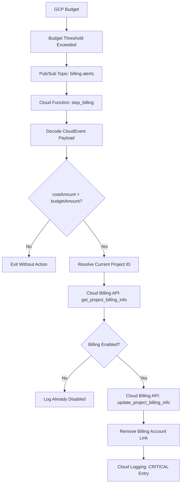

# python-workspace

[](https://github.com/hcombalicer/python-workspace/actions/workflows/deployment.yml)
[](https://github.com/hcombalicer/python-workspace/actions/workflows/daily_check.yml)
[](https://github.com/hcombalicer/python-workspace/blob/main/.github/workflows/deploy_gcp_billing_automation.yml)

## GCP Billing Automation

`gcp_billing_automation` contains a Google Cloud Function that listens for budget alert events and disables billing for the project where the function is deployed when the reported cost exceeds the configured budget amount.

### What GCP Billing Automation does

1. Receives a budget alert event from Pub/Sub.
2. Decodes the event payload and reads `costAmount` and `budgetAmount`.
3. Resolves the current GCP project ID from `GOOGLE_CLOUD_PROJECT` or the metadata server.
4. Checks whether billing is still enabled for that project.
5. Unlinks the project from its billing account when the budget threshold is exceeded.
6. Writes the action to Cloud Logging.

### Deployment and testing

The GitHub Actions workflow [deploy_gcp_billing_automation.yml](.github/workflows/deploy_gcp_billing_automation.yml) runs when files under [gcp_billing_automation](gcp_billing_automation/) change on `main`, installs the function dependencies, runs the pytest suite for that module, authenticates to Google Cloud through Workload Identity Federation, and deploys the function as a Gen 2 Cloud Function.

Local test command:

```bash
pytest gcp_billing_automation/test_*.py
```

### Runtime Architecture Diagram



### Deployment Diagram

```mermaid
graph LR
    A[Developer Push/PR to `main`] --> B{GitHub Repository (gcp_billing_automation/)}
    B --> C[GitHub Actions Workflow: deploy_gcp_billing_automation.yml]
    C --> D[Checkout Code]
    D --> E[Setup Python Environment]
    E --> F[Install Dependencies (pip)]
    F --> G[Run Unit Tests (pytest)]
    G -- Tests Pass --> H[Authenticate to GCP (Workload Identity Federation)]
    H --> I[Deploy Cloud Function (Gen 2)]
    I --> J[Google Cloud Platform]
    G -- Tests Fail --> K[Notify Developer / Halt Deployment]
```

## Task Notifier

`task_notifier` is a Python script designed to help users stay on top of their important Google Tasks by sending timely reminders to a Telegram chat. It integrates with Google Tasks to identify overdue items and uses the Telegram Bot API for notifications. This script is intended to be run periodically, for instance, via a scheduled GitHub Action.

### What Task Notifier does

1. **Authenticates with Google Tasks**: Securely connects to the Google Tasks API using credentials provided via environment variables.
2. **Identifies Overdue Tasks**: Fetches tasks from a designated Google Task list (e.g., "Important") and filters for tasks that have passed their due date.
3. **Sends Telegram Notifications**: For each overdue task, it composes a reminder message and sends it to a specified Telegram chat via the Telegram Bot API.

### High-Level Architecture

```mermaid
graph TD
    A[Scheduled GitHub Action] --> B[notifier.py Script]
    B --> C[Google Tasks API]
    C -- Overdue Tasks --> B
    B --> D[Telegram Bot API]
    D -- Notifications --> E[User (Telegram)]

    subgraph Credentials/Configuration
        F[Environment Variables]
        F -- GOOGLE_TOKEN_JSON --> B
        F -- TELEGRAM_TOKEN --> B
        F -- TELEGRAM_CHAT_ID --> B
    end
```
