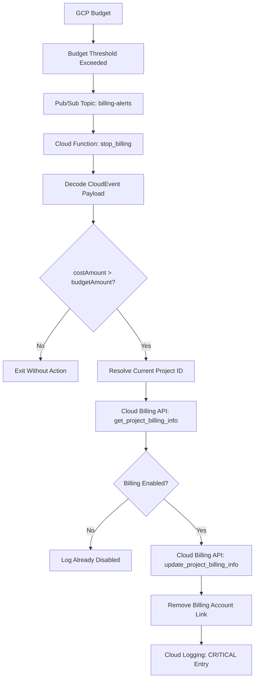

# python-workspace

[](https://github.com/hcombalicer/python-workspace/actions/workflows/deployment.yml)
[](https://github.com/hcombalicer/python-workspace/actions/workflows/daily_check.yml)

## GCP Billing Automation

`gcp_billing_automation` contains a Google Cloud Function that listens for budget alert events and disables billing for the project where the function is deployed when the reported cost exceeds the configured budget amount.

### What it does

1. Receives a budget alert event from Pub/Sub.
2. Decodes the event payload and reads `costAmount` and `budgetAmount`.
3. Resolves the current GCP project ID from `GOOGLE_CLOUD_PROJECT` or the metadata server.
4. Checks whether billing is still enabled for that project.
5. Unlinks the project from its billing account when the budget threshold is exceeded.
6. Writes the action to Cloud Logging.

### Deployment and testing

The GitHub Actions workflow [deploy_gcp_billing_automation.yml](.github/workflows/deploy_gcp_billing_automation.yml) runs when files under [gcp_billing_automation](gcp_billing_automation/) change on `main`, installs the function dependencies, runs the pytest suite for that module, authenticates to Google Cloud through Workload Identity Federation, and deploys the function as a Gen 2 Cloud Function.

Local test command:

```bash
pytest gcp_billing_automation/test_*.py
```

### Architecture diagram



### Key files

- [gcp_billing_automation/main.py](gcp_billing_automation/main.py) contains the Cloud Function and billing logic.
- [gcp_billing_automation/test_main.py](gcp_billing_automation/test_main.py) contains the pytest unit tests.
- [gcp_billing_automation/sample_data](gcp_billing_automation/sample_data/) contains example event payloads for reference.
